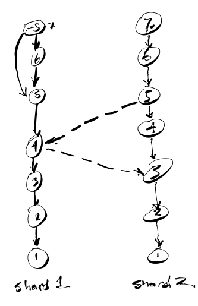

# bc

This is a POC for how you would garbage-collect a block-chained structure.
Normally, it's the EVENT stream that is blockchained, rather than the DATABASE
that contains all the data.  A few problems:

- A list of events always grows larger, by definition.
- If you use hashpointers, there isn't a straightforward mechanism to do trash-compacting without invalidating things.  That is the point, but it may be an _unnecessary_ point.
- What you really want is to validate that the DATABASE has the contents you expect.  It doesn't MATTER how you created the database.

So, instead of chaining hashes together to make every object transitively immutable:

```
((value0 * Hashfunc) + value1) * Hashfunc
```
Iterating this is non-commutative, and non-associative.


As an alternative, we can just iterate the contents:

```
(value0 * Hashfunc) + (value1 * Hashfunc) ....
```

The result is that including objects is associative, and mostly commutative.  (ie: Add then Delete is not the same result as Delete then Add.  If you want that to ALSO commute, then you have to hold a request to delete until it is actually added.  ie: a negative reference count, so that when it is added, it still doesn't appear in the database.)

The reason you want to do this is that:

- When you add an object into a database, its hash is added.
- When you delete an object from the database, its hash is removed.
- This is done by hashing objects into Elliptic Curve points


```
# The trash-compacted version of this data is fine.
obj1 + obj2 + obj3 + -obj2 = obj1 + obj3
```

So, if I sign a non-trash-compacted version of it, the signature is still unchanged after garbage collection.

Example:

```
go run main.go

011acfc8e174fe566b31d9d52973156c95baf9f4befa4742122706fee4c72e056c5ed0c098ef2ed8ee7dfc180f2eae2716fa5aa18a22a395d49a75a5c31da134cd46,3b0c5b1358ec4dfef20f26854df8afcca10ebad5776f23fad79404cb2c33db4a9795804925104f6718c27c2bc328295d75b19dc5ee4770030baef1a5261f9e4dd2

7e2b0a7095e1f431354e724fd9360554816ae9cdd63f84f5d01cda0deda08c65ce49823d14f4bbbe196840fec31fe66fee1939a638bc569fc3507e2970deca1f4b,9958ab798e7955c0c8db51a7925da800a9840e454f6fef9713bd0f1e760b1817da2f00ecd4fa1ac6f98441b89135d5609012719ed4e6ea277c11f58af08dcf5967

011acfc8e174fe566b31d9d52973156c95baf9f4befa4742122706fee4c72e056c5ed0c098ef2ed8ee7dfc180f2eae2716fa5aa18a22a395d49a75a5c31da134cd46,3b0c5b1358ec4dfef20f26854df8afcca10ebad5776f23fad79404cb2c33db4a9795804925104f6718c27c2bc328295d75b19dc5ee4770030baef1a5261f9e4dd2
```

This is:

```
insert event1
insert event2
remove event1
```

# Shards



The database is cut into shards.  Each shard is associated with a writer. The writer has the private key for signing off on contents of a shard.  The public key is obtainable for all shards.  The hashes being signed are over which objects are currently _in_ the database; not a signature over the event stream itself.
